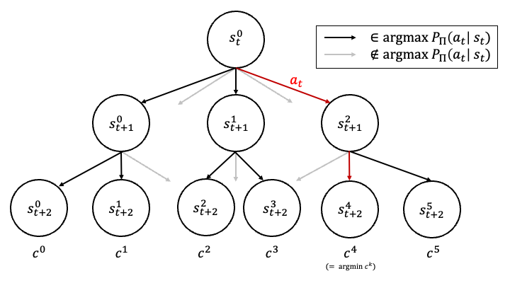

# Robust Guided Forest Search for Unit Commitment

Vassili Chesterkine, Thomas Wright, Paul Theron

---

This is the course project for 6.8200 Computational Sensorimotor Learning. The course is taught by [Prof. Pulkit Agrawal](https://scholar.google.com/citations?user=UpZmJI0AAAAJ&hl=en&oi=ao).

Report is available [here](./report.pdf).

## Project Description
In this project, we explore the unit commitment (UC) problem. UC is a combinatorial power grid optimization problem that aims to find the optimal set of generators to be turned on and off at each timestep, in order to meet the demand of the system while minimizing the cost of the system. We tackle UC using a reinforcement learning approach.

## Method
*Our project introduces a unique solution to the unit commitment problem through reinforcement learning, utilizing a guided forest search algorithm that leverages an RL agent as a heuristic guide. Our innovative method aggregates best action predictions by constructing a forest of trees, based on perturbations around the tree's initial state to account for uncertainty.*

In UC, one is given the current on/off status for each generator in the grid, as well as forecasts for upcoming timesteps. Considering operational constraints, a commitment is calculated for the next timestep. Costs related to the operation of the generators and to not meeting the demand in power are incurred as a negative reward, which is to be minimized.

One way to tackle UC is to consider a tree search where each node represents a state, from which the search tree is expanded to consider all possible commitment decisions at this step. To deal with the exponentially growing action space, we adopted local tree-search methods using RL policies trained offline. Nodes in our Markov decision process (MDP) represent observations, with edges representing feasible actions. At each node (state), only the top M most likely actions, according to the trained policy π, are considered as possible actions, ensuring the search tree's complexity remains scalable.

<p align="center">
  
</p>

One key observation we made is that an RL policy can be sensitive to initial conditions and state. We found that by building trees rooted at different perturbed initial states, we explored at least 7% more of the action space. This led us to propose a new search algorithm called Robust Guided Forest Search algorithm.

This algorithm constructs a forest, each tree's root being a perturbation of the initial state. Each tree is expanded with actions suggested by the trained policy applied to the perturbed state. The tree expands to a fixed depth, and each leaf node accumulates the cost of the actions leading to it. A Uniform Cost Search (UCS) retrieves the minimum-cost path and the first action along that path for each timestep of the episode. The final action decision is made based on one of two path-finding strategies, either minimizing worst-case costs across scenarios or minimizing average costs across scenarios, which can be tailored to specific robustness requirements of the power system.


This approach focuses on improving the robustness of the algorithm, which is crucial when dealing with power systems, particularly under conditions of poor or highly variable supply or demand forecasts. Importantly, the method can be parallelized, which limits the additional computational cost.

### Environment

Our work uses the environment provided by [RL4UC](https://github.com/pwdemars/rl4uc). The environment is analagous the OpenAI ```gym``` interface.

## Environment

To create the environment, run the following command in the terminal:

```bash

conda create -n sensorimotor_env python=3.9

conda activate sensorimotor_env
```

To install the required packages, run the following command

```bash

pip install -r requirements.txt

```


